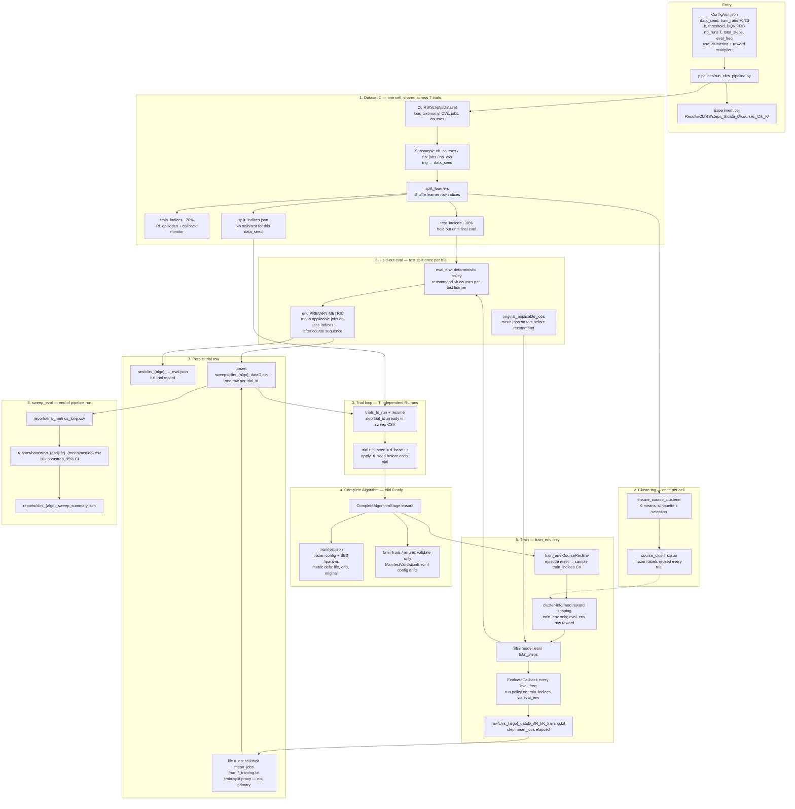
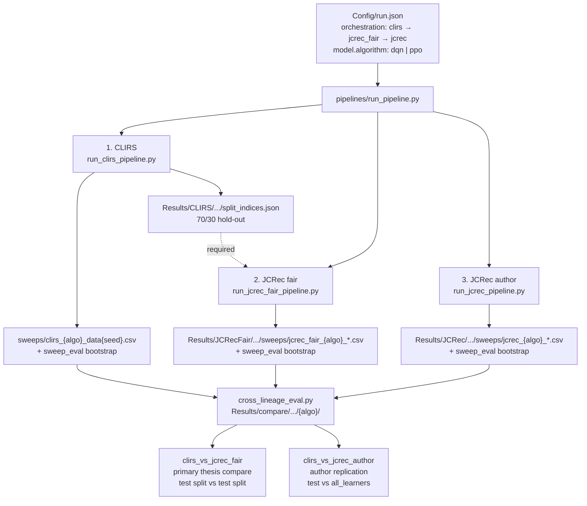

# CLIRS — Course Recommendation with Cluster-Informed Reward Shaping RL

Reinforcement learning system that recommends courses to learners using **CLuster-Informed Reward Shaping** and mastery-level skill profiles.

## Overview

- K-means clustering on course features; reward adjusted by cluster transitions during training
- RL algorithms: DQN, PPO (Stable-Baselines3)
- Learner train / test split (70/30); metrics reported on held-out test CVs
- Primary metric: number of applicable jobs (configurable threshold)

## CLIRS pipeline (proposed method)

End-to-end flow for `run_clirs_pipeline.py` — from config and data split through Complete Algorithm freeze, RL training, held-out evaluation, and sweep statistics.



| Phase | What happens | Key output |
|-------|----------------|------------|
| **Split** | Learner CV rows shuffled with `data_seed`; 70% train / 30% test | `split_indices.json` |
| **Clustering** | Course features clustered once; labels frozen for all trials | `course_clusters.json` |
| **Complete Algorithm** | Trial 0 freezes experiment definition; later runs validate | `manifest.json` |
| **Train** | SB3 learns on `train_env` with optional shaping; callback monitors train split | `*_training.txt` → **`life`** |
| **Eval** | Policy runs once on held-out test learners (no shaping) | **`end`** (primary) |
| **Sweep stats** | Aggregate T trials with bootstrap CI | `bootstrap_*.csv`, sweep summary |

**Metric contract:** report conclusions on **`end`** (test split, after training). **`life`** is a training-progress proxy on the train split only. See `Utils/complete_algorithm.py` for definitions copied into `manifest.json`.

## Pipeline overview (orchestration)

One command runs all lineages in order, then cross-lineage comparison. Change `model.algorithm` in `Config/run.json` (`dqn` or `ppo`) between runs; compare outputs are keyed by algorithm so they do not overwrite.



**Per-lineage cells:** `Results/{CLIRS|JCRecFair|JCRec}/steps_{S}/data_{D}/courses_{C}/k_{K}/`

**Compare artifacts:** `pairwise_comparison.csv`, `bootstrap_*.csv`, `plots/ecdf_*.png`, `report.md`

## Project structure

```
CLIRS-Recsys/
├── CLIRS/
│   └── Scripts/              # env, RL, dataset, clustering (no pipeline — see pipelines/)
├── JCRecFair/                # fair baseline (CLIRS split + jcrec env)
├── jcrec/                    # author baselines (Greedy, Optimal, Reinforce)
├── pipelines/                # run_pipeline.py, run_*_pipeline.py, cross_lineage_eval.py
├── Config/
│   ├── run.json              # primary config (pipeline reads this)
│   └── run.yaml              # flat reference / documentation
├── Data/                     # dataset (taxonomy, CVs, jobs, courses)
├── Docs/
│   └── README_DEVELOPMENT.md # architecture, clustering, results
├── Utils/
│   ├── results_paths.py              # canonical Results/ layout (used by pipeline + plots)
│   ├── visualize_learning_curves.py  # learning-curve plots from raw logs
│   └── general_utils.py              # shared helpers (placeholder)
├── Results/                  # training outputs (gitignored)
└── pyproject.toml            # Poetry dependencies
```

## Quick start

### 1. Install (Poetry)

```bash
poetry lock
poetry install
```

Use `poetry shell` or prefix commands with `poetry run`.

### 2. Run training

```bash
poetry run python pipelines/run_pipeline.py --Config Config/run.json
```

Or a single backend:

```bash
poetry run python pipelines/run_clirs_pipeline.py --Config Config/run.json
poetry run python pipelines/run_jcrec_fair_pipeline.py --Config Config/run.json
poetry run python pipelines/run_jcrec_pipeline.py --Config Config/run.json
```

Regenerate compare only (after sweeps exist):

```bash
poetry run python pipelines/cross_lineage_eval.py --Config Config/run.json
```

### 3. Plot learning curves (optional)

```bash
poetry run python Utils/visualize_learning_curves.py
```

## Results layout

All training outputs go under `Results/` (gitignored). Path resolution is centralized in `Utils/results_paths.py` (`ensure_experiment_dirs`, `trial_artifact_paths`, `append_trial_csv_row`).

```
Results/
├── CLIRS/steps_{steps}/data_{seed}/courses_{nb}/k_{k}/       # proposed method
├── JCRecFair/steps_{steps}/data_{seed}/courses_{nb}/k_{k}/   # fair baseline (test split)
├── JCRec/steps_{steps}/data_{seed}/courses_{nb}/k_{k}/       # author reproduction
└── compare/steps_{steps}/data_{seed}/courses_{nb}/k_{k}/{algo}/
    ├── clirs_vs_jcrec_fair/
    └── clirs_vs_jcrec_author/
```

Each lineage cell:

```
Results/{CLIRS|JCRecFair|JCRec}/steps_*/data_*/courses_*/k_*/
    ├── run.log                 # only if warnings/errors (omit = run OK)
    ├── manifest.json
    ├── split_indices.json      # CLIRS + JCRecFair: train/test; JCRec: all_learners
    ├── sweeps/{method}_data{seed}.csv
    └── raw/{method}_data{seed}_rl{rl}_k{k}_eval.json
```

**Naming:** CLIRS → `clirs_{algo}`; JCRec fair → `jcrec_fair_{algo}`; JCRec author → `jcrec_{algo}`. All pipelines read `model.algorithm` in `Config/run.json` (e.g. `dqn`, `ppo`).

**Complete Algorithm:** `Utils/complete_algorithm.py` writes `manifest.json` on the first trial of a cell (SB3 hyperparameters + metric definitions). Later runs validate config against that manifest and refuse to mix experiments in the same folder. See [`Docs/README_DEVELOPMENT.md`](Docs/README_DEVELOPMENT.md#evaluation-metrics-life-vs-end).

**Run log:** `run.log` is created only when a run has warnings or errors (compact report, not full console). No file means the run looked fine — send `run.log` to the maintainer only if it exists. `Results/orchestration.log` is written only when orchestration fails or a cell produced a `run.log`.

**T trials:** `experiment.nb_runs` independent RL trials share one dataset/split (`data_seed`); trial `t` uses `rl_seed = seeds.rl_base + t`. Sweep CSV upserts by `trial_id`; resume skips completed trials. Column `evaluation_split`: CLIRS + JCRec fair `test` (70/30 hold-out); JCRec author `all_learners`. End-of-run bootstrap summary → `reports/{method}_sweep_summary.json`.

**Manage outputs:**

```bash
poetry run python CLIRS/Scripts/manage_results.py list
poetry run python CLIRS/Scripts/manage_results.py backup --config Config/run.json
```

## Dependencies

Managed in `pyproject.toml` (Python ^3.10): stable-baselines3, gymnasium, scikit-learn, numpy, pandas, matplotlib, seaborn, PyYAML, tqdm.

Legacy list: `requirements.txt`.

